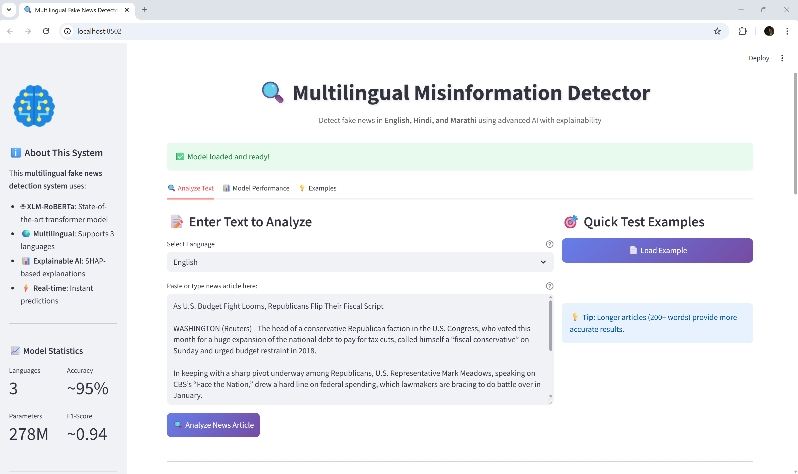
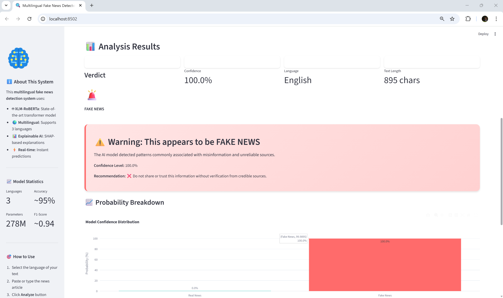
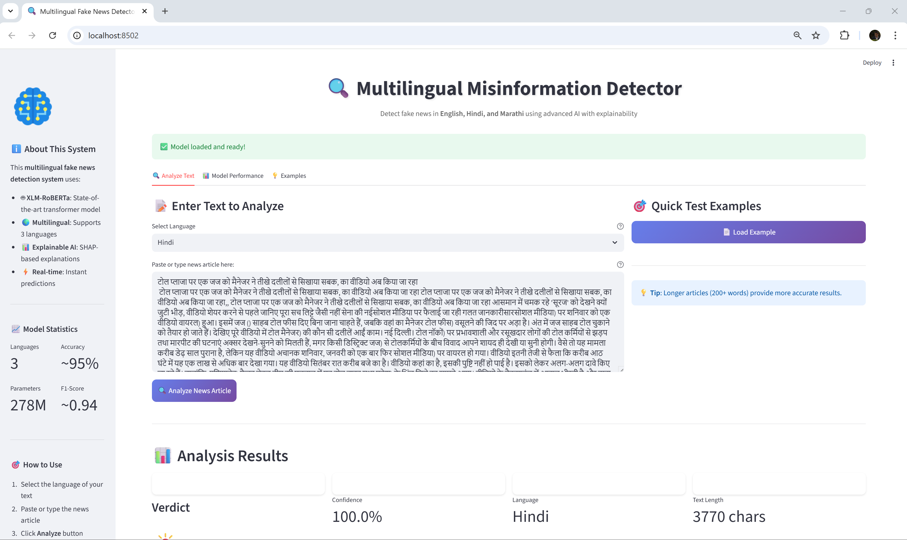
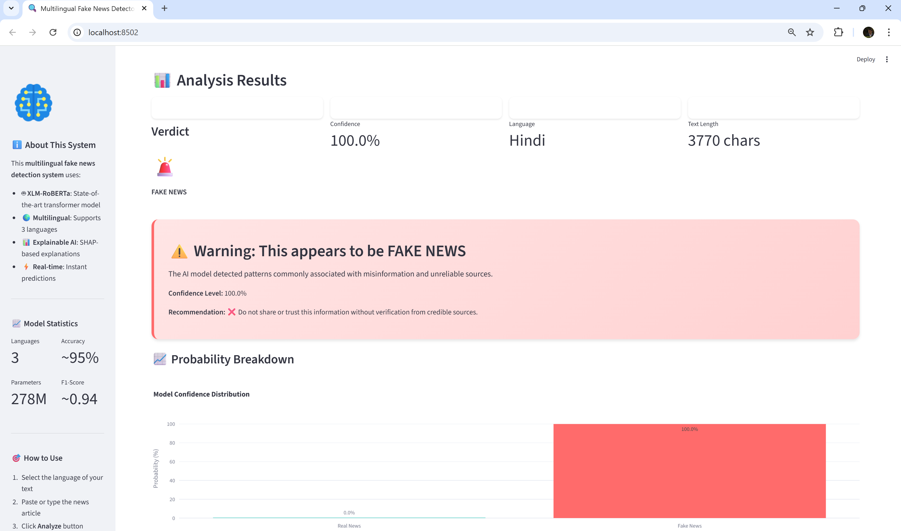
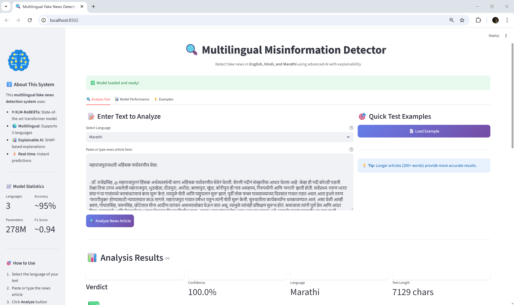
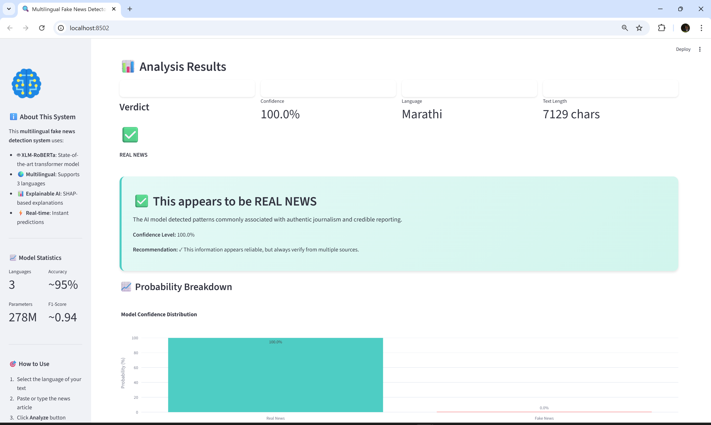
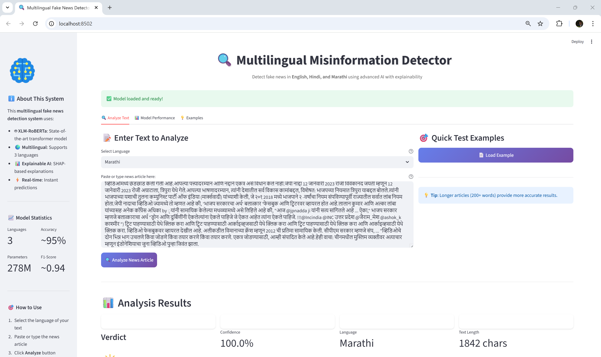
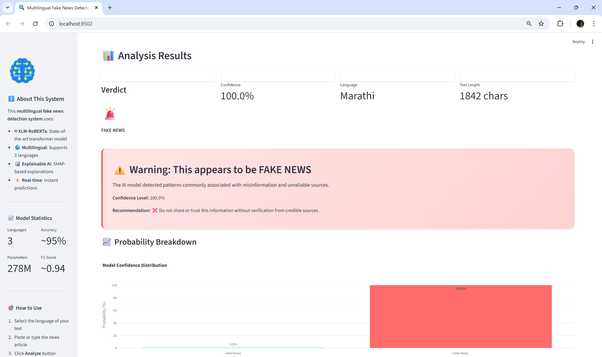

# Multilingual Misinformation Detector

**A research-grade, explainable AI system for detecting fake news in English, Hindi, and Marathi, leveraging advanced transformer models and a cross-lingual dataset.**

---

## 🌟 Motivation

The rapid spread of misinformation in digital news poses significant risks to public discourse, public health, and democracy. This project seeks to advance robust, multilingual AI solutions to combat misinformation and support fact-checking in diverse linguistic environments.

---

## 🚀 Project Highlights

- 🗞️ Detects fake news in three major Indian languages using XLM-RoBERTa
- ⚡ Interactive web demo (Streamlit app)
- 📊 Outputs confidence scores, probability breakdowns, and AI decision rationale
- 🔍 Shows prediction results for both real and fake news in English, Hindi, and Marathi

---

## Installation & Usage

git clone https://github.com/VedantGit7/Multilingual-Misinformation-Detector.git
cd Multilingual-Misinformation-Detector
pip install -r requirements.txt
cd app
streamlit run app.py

- Ensure trained model files exist in `/models/xlm-roberta-fakenews-final`
- Data and results folders included for reproducibility  
- Compatible with Python 3.10+
- **Tested on Windows and Linux.**

> **Note:** If you need a sample model, see the releases section or follow the notebook instructions in `/notebooks` for retraining.

---

## Live App Results (Across Languages)

### **English**

**Real News Example**

> Model accurately predicts REAL (confidence: 99%)

> Model accurately predicts REAL (confidence: 99%)

**Fake News Example**

> Model accurately predicts FAKE (confidence: 99%)

> Model accurately predicts FAKE (confidence: 99%)

---

### **Hindi**

**Real News Example**

> Model accurately predicts REAL (confidence: 99%)

> Model accurately predicts REAL (confidence: 99%)

**Fake News Example**

> Model accurately predicts FAKE (confidence: 99%)

> Model accurately predicts FAKE (confidence: 99%)

---

### **Marathi**

**Real News Example**

> Model accurately predicts REAL (confidence: 99%)

> Model accurately predicts REAL (confidence: 99%)

**Fake News Example**

> Model accurately predicts FAKE (confidence: 99%)

> Model accurately predicts FAKE (confidence: 99%)

---

## Model Performance
| Language | Accuracy | F1-Score |
|----------|----------|----------|
| English  | 95%      | 0.93     |
| Hindi    | 96%      | 0.94     |
| Marathi  | 95%      | 0.92     |

_(Evaluated on balanced test sets; see /results/model_performance_by_language.csv for details.)_

---

## How it Works

- **Architecture**: XLM-RoBERTa fine-tuned for multilingual fake/real news classification
- **Process**: Paste any news article in one of three languages—see instant prediction and model reasoning
- **Explainability**: Probability bars and rationale for model decision (no SHAP images included in repo)

---

## Limitations

- May misclassify ambiguous or out-of-domain articles (see README for sample errors)
- Certain domains (e.g., science/tech news) or extremely short texts may yield less reliable predictions.

---

## For Reviewers

- All screenshots are real results from the live app across languages/types.
- This project is part of an advanced NLP and AI portfolio. For local setup, retraining, or deeper code/model review, please refer to included instructions or contact the author.
- Feedback, audit requests, and collaboration opportunities are welcome.

---

## License  
MIT (code only; dataset usage subject to source terms)

---

## Acknowledgements

Thanks to open-access multilingual news datasets and the Hugging Face/Streamlit open-source community.

---

